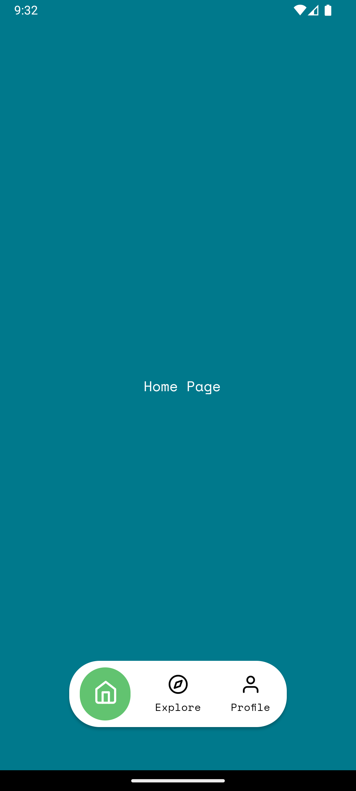
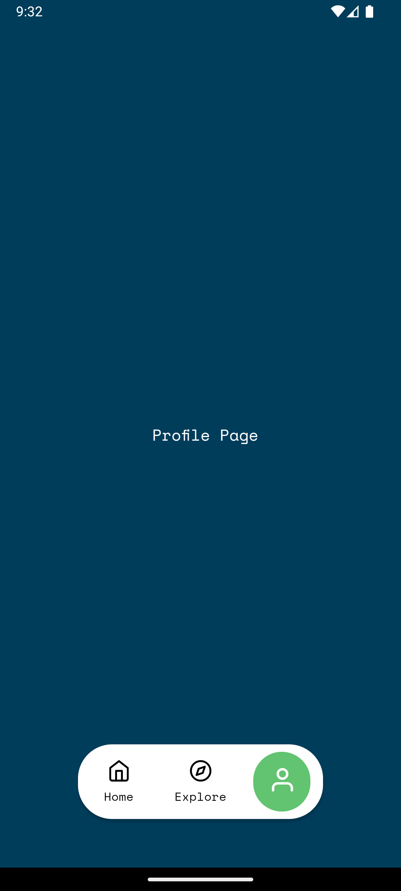

# Custom Tabs (Expo) 🤖

Esta aplicación está desarrollada en Expo utilizando Expo Router para la navegación entre diferentes pestañas personalizadas. Además, cuenta con animaciones fluidas y responsivas implementadas mediante React Animated, proporcionando una experiencia de usuario más dinámica y atractiva.

## Empezar

1. Instalar dependencias

   ```bash
   npm install
   ```

2. Iniciar la aplicación

   ```bash
    npx expo start
   ```

## Vistas Previas

| Captura 1 | Captura 2 | Captura 3 |
|-----------|-----------|-----------|
|  |  |  |